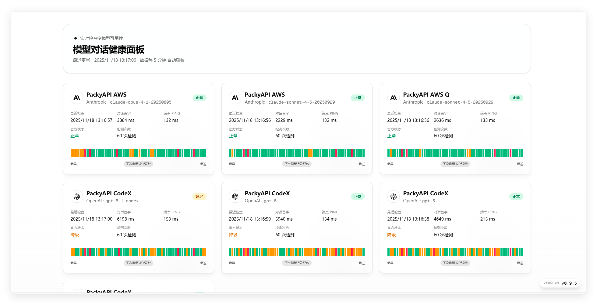

<div align="center">
  <h1>Check CX</h1>

  <p>
    <strong>AI 模型服务健康监控面板</strong>
  </p>

  <p>
    实时跟踪 OpenAI、Gemini、Anthropic 等 AI 模型 API 的可用性、延迟与错误信息
  </p>

  <p>
    <a href="#快速开始">快速开始</a> •
    <a href="#功能特性">功能特性</a> •
    <a href="#配置管理">配置管理</a> •
    <a href="#文档">文档</a>
  </p>

  <p>
    <a href="https://vercel.com/new/clone?repository-url=https%3A%2F%2Fgithub.com%2Fbingzi-233%2Fcheck-cx&env=NEXT_PUBLIC_SUPABASE_URL,NEXT_PUBLIC_SUPABASE_PUBLISHABLE_OR_ANON_KEY&envDescription=Supabase%20project%20credentials&envLink=https%3A%2F%2Fsupabase.com%2Fdashboard&project-name=check-cx&repository-name=check-cx"></a>
    <a href="https://deploy.workers.cloudflare.com/?url=https://github.com/bingzi-233/check-cx"></a>
  </p>

  
</div>

---

## 简介

Check CX 是一套基于 **Next.js 16** + **shadcn/ui** 构建的现代化 AI 服务健康监控系统。它能够:

- ✅ **持续监控**多个 AI 模型服务的健康状态
- ⚡ **实时展示**API 响应延迟与可用性趋势
- 📊 **可视化呈现**历史数据与状态变化
- 🔐 **安全管理**API 密钥(仅在服务端存储)
- 🎯 **灵活配置**任意数量的检测目标
- 🌓 **深色/浅色主题**基于 next-themes 的主题切换
- 📱 **响应式设计**适配桌面端与移动端

**适用场景:**
- 团队内部状态墙/大屏展示
- AI 服务商 SLA 监控
- 多供应商服务质量对比
- API 故障快速定位

## 功能特性

### 🎯 灵活的配置管理

- 通过 Supabase 数据库管理所有检测配置
- 支持 OpenAI、Gemini、Anthropic 及自定义端点
- 配置修改即时生效，无需重启服务
- 支持批量启用/禁用检测任务
- **支持配置分组管理**，按服务商或用途组织配置
- **维护模式**，临时暂停检测而不删除配置
- **自定义请求头和请求参数**，灵活适配各种 API 端点

### ⏱️ 可靠的健康检查

- 基于 Vercel AI SDK 的统一检测逻辑
- **数学挑战验证**：发送随机数学问题，验证回复正确性，防止假站点绕过
- 可配置检测间隔(15-600 秒)
- 支持检测并发数控制(默认 5 并发)
- 自动超时控制(默认 45 秒)
- 智能状态判定:
  - `operational`: 延迟 ≤ 6s 且验证通过
  - `degraded`: 延迟 > 6s 但验证通过
  - `validation_failed`: 收到回复但答案验证失败
  - `failed`: 请求失败或超时
  - `error`: 请求过程中发生异常

### 📈 直观的数据展示

- 时间轴展示最近 1 小时的检测历史
- 实时延迟曲线与状态变化
- 自动刷新倒计时显示
- **分组折叠面板**,清晰展示不同类别的服务
- **分组详情页**,深入查看单个分组的所有配置
- **分组信息表**,支持自定义分组描述与元数据
- 响应式设计,支持多屏幕尺寸
- 适合大屏/TV 循环展示

### 🔌 开放的状态 API

- 提供 `/api/v1/status` RESTful API 端点
- 支持按 `group` 和 `model` 参数筛选
- 返回详细统计信息(成功率、平均/最小/最大延迟)
- 包含完整的历史时间线数据
- 便于第三方系统集成与自动化监控

### 📢 系统通知功能

- 支持 **多条通知自动轮播**（5秒切换）
- 三种通知级别：`info`、`warning`、`error`
- 支持 **Markdown 格式** 内容
- 可设置通知起止时间，自动显示/隐藏
- 用户可手动关闭通知横幅

### 🎨 现代化 UI 体验

- 基于 **next-themes** 的深色/浅色主题切换
- **页面导航进度条**,提升用户体验
- 状态徽章优化,视觉效果更清晰
- 统一的代码格式化风格
- GitHub 仓库快速跳转链接

### 🔒 安全性设计

- API 密钥仅存储在服务端
- 前端只接收聚合后的健康数据
- **日志敏感信息自动脱敏**（API Key、Token 等）
- 支持环境变量与 `.env.local` 管理
- 提供完整的 SQL 迁移脚本

## 快速开始

### 前置要求

- **Node.js** 18.x 或更高版本
- **pnpm** 包管理器
- **Supabase** 账号与项目

### 安装步骤

1. **克隆仓库**

   ```bash
   git clone https://github.com/bingzi-233/check-cx.git
   cd check-cx
   ```

2. **安装依赖**

   ```bash
   pnpm install
   ```

3. **配置环境变量**

   ```bash
   cp .env.example .env.local
   ```

   编辑 `.env.local` 文件,填入你的 Supabase 配置:

   ```env
   # Supabase 配置
   NEXT_PUBLIC_SUPABASE_URL=https://your-project.supabase.co
   NEXT_PUBLIC_SUPABASE_PUBLISHABLE_OR_ANON_KEY=your-anon-key
   SUPABASE_SERVICE_ROLE_KEY=your-service-role-key

   # 检测间隔(秒),范围 15-600,默认 60
   CHECK_POLL_INTERVAL_SECONDS=60
   # 检测并发数,范围 1-20,默认 5
   CHECK_CONCURRENCY=5
   ```

4. **初始化数据库**

   在 Supabase SQL Editor 中执行 `supabase/migrations/` 目录下的迁移脚本,创建必要的表结构。
   最新版本依赖 `get_recent_check_history` 与 `prune_check_history` 两个 RPC,如果你是全新部署可直接运行 `supabase/schema.sql`。
   如果是升级已有数据库,至少需要手动执行 `supabase/migrations/20251127090000_snapshot_functions.sql` 以确保 RPC 存在,否则后端会退回旧的全表扫描逻辑,性能大幅下降。

5. **添加检测配置**

   在 Supabase SQL Editor 中插入至少一个检测配置:

   ```sql
   INSERT INTO check_configs (name, type, model, endpoint, api_key, enabled)
   VALUES (
     'OpenAI GPT-4',
     'openai',
     'gpt-4o-mini',
     'https://api.openai.com/v1/chat/completions',
     'sk-your-api-key',
     true
   );
   ```

6. **启动开发服务器**

   ```bash
   pnpm dev
   ```

7. **访问面板**

   打开浏览器访问 [http://localhost:3000](http://localhost:3000)

### 生产部署

#### Vercel (推荐)

点击一键部署按钮，或手动部署：

```bash
# 使用 Vercel CLI
vercel deploy
```

#### Cloudflare Workers/Pages

> ⚠️ **注意**: Cloudflare Workers 是边缘无状态环境，后台轮询器不会持续运行。建议使用 Cron Triggers 定时触发检测。

```bash
# 构建 Cloudflare 产物
pnpm build:cloudflare

# 本地预览
pnpm preview:cloudflare

# 部署到 Cloudflare
pnpm deploy:cloudflare
```

#### 自建服务器

```bash
# 构建生产版本
pnpm build

# 启动生产服务器
pnpm start
```

## 配置管理

### 数据库表结构

Check CX 使用 Supabase 的两张核心表:

**`check_configs` - 检测配置表**

| 字段 | 类型 | 说明 |
|------|------|------|
| `id` | UUID | 主键,自动生成 |
| `name` | TEXT | 配置名称(如 "主力 OpenAI") |
| `type` | TEXT | Provider 类型: `openai` / `gemini` / `anthropic` |
| `model` | TEXT | 模型名称(支持 effort 指令) |
| `endpoint` | TEXT | API 端点 URL |
| `api_key` | TEXT | API 密钥 |
| `enabled` | BOOLEAN | 是否启用 |
| `is_maintenance` | BOOLEAN | 维护模式，启用后暂停检测 |
| `request_header` | JSONB | 自定义请求头（JSON 格式，可选） |
| `metadata` | JSONB | 自定义请求参数（可选） |
| `group_name` | TEXT | 分组名称（可选） |

**`check_history` - 历史记录表**

| 字段 | 类型 | 说明 |
|------|------|------|
| `id` | UUID | 主键,自动生成 |
| `config_id` | UUID | 关联的配置 ID |
| `status` | TEXT | 状态: `operational` / `degraded` / `failed` / `validation_failed` / `error` |
| `latency_ms` | INTEGER | 响应延迟(毫秒) |
| `ping_latency_ms` | INTEGER | 端点 Ping 延迟(毫秒) |
| `checked_at` | TIMESTAMPTZ | 检测时间 |
| `message` | TEXT | 错误信息(可选) |

**`system_notifications` - 系统通知表**

| 字段 | 类型 | 说明 |
|------|------|------|
| `id` | UUID | 主键,自动生成 |
| `message` | TEXT | 通知内容(支持 Markdown) |
| `is_active` | BOOLEAN | 是否启用 |
| `level` | TEXT | 级别: `info` / `warning` / `error` |
| `created_at` | TIMESTAMPTZ | 创建时间 |

### 数据库函数

为了避免在 API 聚合时做全表扫描,数据库同时提供了两个 RPC:

- `get_recent_check_history(limit_per_config integer, target_config_ids uuid[])`
  - 使用窗口函数一次性返回每个配置最近的 N 条记录;
  - Dashboard、分组 API 以及后台轮询器的快照读取都依赖它。
- `prune_check_history(limit_per_config integer)`
  - 根据同样的窗口结果批量删除多余的旧记录,写入历史后立即调用;
  - 若 RPC 暂时缺失,后端会退回旧的清理逻辑,但性能会大幅下降。

### 添加检测配置

#### OpenAI / OpenAI 兼容端点

```sql
INSERT INTO check_configs (name, type, model, endpoint, api_key, enabled)
VALUES (
  '主力 OpenAI',
  'openai',
  'gpt-4o-mini',
  'https://api.openai.com/v1/chat/completions',
  'sk-your-openai-key',
  true
);
```

#### Gemini

```sql
INSERT INTO check_configs (name, type, model, endpoint, api_key, enabled)
VALUES (
  'Gemini 备份',
  'gemini',
  'gemini-1.5-flash',
  'https://generativelanguage.googleapis.com/v1beta',
  'your-gemini-key',
  true
);
```

#### Anthropic

```sql
INSERT INTO check_configs (name, type, model, endpoint, api_key, enabled)
VALUES (
  'Claude 主力',
  'anthropic',
  'claude-3-5-sonnet-latest',
  'https://api.anthropic.com/v1/messages',
  'sk-ant-your-key',
  true
);
```

### 推理模型 Effort 指令

对于支持 `reasoning_effort` 参数的推理模型(如 OpenAI o1、o3 系列),可以在 `model` 字段中附加 effort 级别:

```sql
-- 使用 @ 或 # 分隔符指定 effort
INSERT INTO check_configs (name, type, model, endpoint, api_key, enabled)
VALUES (
  'OpenAI O1 高推理',
  'openai',
  'o1-preview@high',  -- 或 'o1-preview#high'
  'https://api.openai.com/v1/chat/completions',
  'sk-your-key',
  true
);
```

**支持的 effort 级别:**
- `minimal` - 最低推理能力
- `low` - 较低推理能力
- `medium` - 中等推理能力(未指定时的默认值)
- `high` - 最高推理能力

**自动识别的推理模型关键词:**
`codex`, `gpt-5`, `o1`, `o2`, `o3`, `o4`, `o5`, `o6`, `o7`, `o8`, `o9`, `deepseek-r1`, `qwq`

### 管理现有配置

```sql
-- 查看所有配置
SELECT id, name, type, model, endpoint, enabled
FROM check_configs
ORDER BY created_at DESC;

-- 禁用配置
UPDATE check_configs
SET enabled = false
WHERE name = '主力 OpenAI';

-- 启用配置
UPDATE check_configs
SET enabled = true
WHERE id = 'your-config-uuid';

-- 更新端点或模型
UPDATE check_configs
SET endpoint = 'https://new-endpoint.com/v1/chat/completions',
    model = 'gpt-4o'
WHERE name = '主力 OpenAI';

-- 删除配置
DELETE FROM check_configs
WHERE name = '旧配置';

-- 删除配置及其历史记录
DELETE FROM check_history WHERE config_id = 'your-config-uuid';
DELETE FROM check_configs WHERE id = 'your-config-uuid';
```

### 分组管理

通过 `group_name` 字段可以将配置分组,便于管理和展示。

```sql
-- 添加配置到指定分组
INSERT INTO check_configs (name, type, model, endpoint, api_key, group_name, enabled)
VALUES (
  '主力 OpenAI',
  'openai',
  'gpt-4o-mini',
  'https://api.openai.com/v1/chat/completions',
  'sk-your-key',
  '主力服务商',
  true
);

-- 将现有配置移入分组
UPDATE check_configs
SET group_name = '备选服务商'
WHERE name = 'Gemini 备份';

-- 移出分组(设为未分组)
UPDATE check_configs
SET group_name = NULL
WHERE name = '...';

-- 查看所有分组
SELECT DISTINCT group_name FROM check_configs WHERE group_name IS NOT NULL;
```

**分组特性:**
- 首页按分组折叠展示所有配置
- 点击分组标题可跳转到分组详情页 (`/group/{groupName}`)
- 未设置 `group_name` 的配置归入"未分组"
- 分组按字母序排列,"未分组"显示在最后

### 维护模式

通过 `is_maintenance` 字段可以临时暂停某个配置的检测,而不必禁用或删除它。

```sql
-- 启用维护模式(暂停检测)
UPDATE check_configs
SET is_maintenance = true
WHERE name = '主力 OpenAI';

-- 恢复正常检测
UPDATE check_configs
SET is_maintenance = false
WHERE name = '主力 OpenAI';

-- 查看所有维护中的配置
SELECT name, type, model FROM check_configs WHERE is_maintenance = true;
```

**维护模式特性:**
- 维护中的配置不会执行实际检测
- 在 Dashboard 中显示为特殊的"维护中"状态
- 历史记录保留,恢复后继续累积
- 适用于已知服务商维护、计划停机等场景

### 系统通知管理

通过 `system_notifications` 表可以发布全站公告,支持多条通知自动轮播。

```sql
-- 发布一条信息通知
INSERT INTO system_notifications (message, level, is_active)
VALUES ('系统将于今晚 22:00 进行维护,预计持续 30 分钟。', 'info', true);

-- 发布警告通知（支持 Markdown 格式）
INSERT INTO system_notifications (message, level, is_active)
VALUES ('**注意**: 部分 API 响应延迟较高,我们正在排查中。', 'warning', true);

-- 发布错误级别通知
INSERT INTO system_notifications (message, level, is_active)
VALUES ('OpenAI 服务商出现大面积故障,详情请查看 [官方状态页](https://status.openai.com)', 'error', true);

-- 关闭通知
UPDATE system_notifications
SET is_active = false
WHERE id = 'notification-uuid';

-- 查看所有活跃通知
SELECT * FROM system_notifications WHERE is_active = true ORDER BY created_at DESC;

-- 删除通知
DELETE FROM system_notifications WHERE id = 'notification-uuid';
```

**通知级别样式:**
- `info`: 蓝色背景,信息图标
- `warning`: 橙色背景,警告图标
- `error`: 红色背景,错误图标

### 自定义请求头

某些 API 端点可能对默认请求头有限制，可以通过 `request_header` 字段自定义多个请求头（JSON 格式）。

```sql
-- 设置自定义请求头（JSON 格式，支持多个头）
UPDATE check_configs
SET request_header = '{"User-Agent": "Mozilla/5.0 (Windows NT 10.0; Win64; x64)", "X-Custom-Header": "value"}'
WHERE name = '主力 OpenAI';

-- 仅设置 User-Agent
UPDATE check_configs
SET request_header = '{"User-Agent": "check-cx/1.0.0"}'
WHERE name = '主力 OpenAI';

-- 清除自定义请求头（恢复使用默认值）
UPDATE check_configs
SET request_header = NULL
WHERE name = '主力 OpenAI';
```

### 自定义请求参数

通过 `metadata` 字段可以自定义 API 请求体参数（JSONB 格式），这些参数会合并到请求中。

```sql
-- 设置自定义请求参数
UPDATE check_configs
SET metadata = '{"temperature": 0.5, "max_tokens": 50}'
WHERE name = '主力 OpenAI';

-- 同时设置请求头和请求参数
UPDATE check_configs
SET request_header = '{"User-Agent": "custom-agent/1.0"}',
    metadata = '{"temperature": 0.7}'
WHERE name = '主力 OpenAI';

-- 清除自定义参数
UPDATE check_configs
SET metadata = NULL
WHERE name = '主力 OpenAI';
```

## 项目架构

```
check-cx/
├── app/                          # Next.js App Router
│   ├── page.tsx                 # 主页面 (Dashboard)
│   ├── group/
│   │   └── [groupName]/
│   │       └── page.tsx         # 分组详情页
│   ├── api/
│   │   ├── dashboard/           # Dashboard 数据 API
│   │   ├── v1/
│   │   │   └── status/          # 状态查询 API (对外开放)
│   │   └── group/
│   │       └── [groupName]/     # 分组数据 API
│   └── layout.tsx               # 全局布局
├── components/                   # React 组件
│   ├── dashboard-view.tsx       # Dashboard 主视图(含分组面板)
│   ├── group-dashboard-view.tsx # 分组详情视图
│   ├── notification-banner.tsx  # 系统通知横幅(多条轮播)
│   ├── provider-icon.tsx        # Provider 图标组件
│   └── ui/                      # shadcn/ui 组件
├── lib/                         # 核心库
│   ├── core/                    # 核心模块
│   │   ├── poller.ts           # 后台轮询器
│   │   ├── global-state.ts     # 全局状态管理
│   │   ├── health-snapshot-service.ts # 健康快照服务
│   │   ├── dashboard-data.ts   # Dashboard 数据聚合
│   │   ├── group-data.ts       # 分组数据加载
│   │   ├── official-status-poller.ts # 官方状态轮询
│   │   └── polling-config.ts   # 轮询配置
│   ├── providers/               # Provider 检查实现
│   │   ├── index.ts            # 统一入口(并发控制、重试逻辑)
│   │   ├── ai-sdk-check.ts     # 基于 Vercel AI SDK 的统一检查器
│   │   ├── challenge.ts        # 数学挑战生成与验证
│   │   └── endpoint-ping.ts    # 端点 Ping 延迟测量
│   ├── official-status/         # 官方状态页抓取
│   │   ├── index.ts            # 统一入口
│   │   ├── openai.ts           # OpenAI 官方状态
│   │   └── anthropic.ts        # Anthropic 官方状态
│   ├── database/                # 数据库操作
│   │   ├── config-loader.ts    # 配置加载
│   │   ├── history.ts          # 历史记录管理
│   │   ├── group-info.ts       # 分组信息管理
│   │   └── notifications.ts    # 系统通知管理
│   ├── types/                   # TypeScript 类型定义
│   ├── utils/                   # 工具函数
│   └── supabase/                # Supabase 客户端
├── supabase/
│   └── migrations/              # 数据库迁移脚本
└── docs/                        # 文档
    ├── ARCHITECTURE.md          # 架构文档
    ├── OPERATIONS.md            # 运维手册
    └── EXTENDING_PROVIDERS.md   # Provider 扩展指南
```

### 数据流向

```
后台轮询 → 数据库 → 前端展示
   ↓          ↓         ↓
poller.ts → Supabase → dashboard-view.tsx (首页)
   ↓          ↓         ↓
providers/ → check_history → group-dashboard-view.tsx (分组页)
                              ↓
                          /api/group/[groupName]
```

### 核心工作流程

1. **后台轮询**
   - `lib/core/poller.ts` 在应用启动时自动初始化
   - 按 `CHECK_POLL_INTERVAL_SECONDS` 间隔执行检测
   - 使用全局状态防止重复执行

2. **健康检查**
   - `lib/providers/index.ts` 并发执行所有启用的配置
   - 使用 Vercel AI SDK (`lib/providers/ai-sdk-check.ts`) 统一处理所有 Provider
   - 发送数学挑战问题并验证回复，确保模型真实可用

3. **数据存储与裁剪**
   - `lib/database/history.ts` 通过 RPC `get_recent_check_history`/`prune_check_history` 写入并裁剪历史
   - 每个配置最多保留 60 条记录，缺少 RPC 时自动退回旧逻辑以保证兼容

4. **健康快照聚合**
   - `lib/core/health-snapshot-service.ts` 统一处理缓存、刷新策略与官方状态附加
   - `app/api/dashboard` 与 `/group/[groupName]` 共享同一聚合路径，避免重复实现

5. **前端展示**
   - `components/dashboard-view.tsx` 定期调用 API 获取最新数据
   - 首页按分组折叠展示所有配置
   - `components/group-dashboard-view.tsx` 展示单个分组详情
   - 展示时间轴、状态卡片、延迟曲线
   - 自动刷新倒计时

## 常用命令

```bash
# 开发
pnpm dev              # 启动开发服务器
pnpm lint             # 代码检查
pnpm type-check       # TypeScript 类型检查

# 构建
pnpm build            # 构建生产版本
pnpm start            # 启动生产服务器

# 数据库
pnpm db:types         # 生成 Supabase 类型定义
```

## 环境变量说明

| 变量名 | 必需 | 默认值 | 说明 |
|--------|------|--------|------|
| `NEXT_PUBLIC_SUPABASE_URL` | ✅ | - | Supabase 项目 URL |
| `NEXT_PUBLIC_SUPABASE_PUBLISHABLE_OR_ANON_KEY` | ✅ | - | Supabase 公开密钥 |
| `SUPABASE_SERVICE_ROLE_KEY` | ❌ | - | Supabase Service Role Key (服务端使用,绕过 RLS) |
| `CHECK_POLL_INTERVAL_SECONDS` | ❌ | 60 | 检测间隔(秒),范围 15-600 |
| `CHECK_CONCURRENCY` | ❌ | 5 | 检测并发数,范围 1-20 |
| `OFFICIAL_STATUS_CHECK_INTERVAL_SECONDS` | ❌ | 300 | 官方状态检查间隔(秒),范围 60-3600 |

## 文档

- [**架构文档**](docs/ARCHITECTURE.md) - 系统架构与模块设计
- [**运维手册**](docs/OPERATIONS.md) - 部署、监控与故障排查
- [**扩展指南**](docs/EXTENDING_PROVIDERS.md) - 添加新 Provider 的开发指南

## 常见问题

### 1. 轮询器没有自动启动?

检查服务器日志,确认 `lib/core/poller.ts` 已被加载。在开发模式下,Next.js 热重载可能导致轮询器重复初始化,这是正常现象。

### 2. 配置修改后没有生效?

配置会在下一次轮询时自动加载,无需重启服务。检查配置的 `enabled` 字段是否为 `true`。

### 如何调整检测超时时间?

在 `lib/providers/ai-sdk-check.ts` 中修改 `DEFAULT_TIMEOUT_MS` 常量(默认 45000ms)。

### 如何添加自定义 Provider?

当前版本基于 Vercel AI SDK 统一实现，支持 OpenAI、Anthropic、Gemini 三种 Provider 类型。如需添加新类型，需要修改 `lib/providers/ai-sdk-check.ts` 中的 `createModel` 函数。

### 历史数据能保存多久?

每个配置最多保留 60 条历史记录。如需更长时间保存,可以修改 `lib/database/history.ts` 中的 `MAX_HISTORY_PER_CONFIG` 常量。

### 如何使用分组功能?

在 `check_configs` 表中设置 `group_name` 字段即可。相同 `group_name` 的配置会自动归为一组,在首页以折叠面板形式展示。点击分组标题可进入分组详情页。

### 维护模式和禁用有什么区别?

- **禁用** (`enabled = false`): 配置完全不执行,不显示在 Dashboard 中
- **维护模式** (`is_maintenance = true`): 配置仍显示在 Dashboard 中,但显示为"维护中"状态,不执行实际检测

### 如何发布系统通知?

在 `system_notifications` 表中插入记录即可。支持三种级别(`info`/`warning`/`error`)和 Markdown 格式。多条活跃通知会自动轮播。

## 状态查询 API

Check CX 提供 `/api/v1/status` 端点，便于第三方系统集成。

### 基本用法

```bash
# 获取所有 Provider 状态
curl https://your-domain.com/api/v1/status

# 按分组筛选
curl https://your-domain.com/api/v1/status?group=主力服务商

# 按模型筛选
curl https://your-domain.com/api/v1/status?model=gpt-4o-mini

# 组合筛选
curl https://your-domain.com/api/v1/status?group=主力服务商&model=gpt-4o
```

### 响应结构

```json
{
  "providers": [
    {
      "id": "uuid",
      "name": "主力 OpenAI",
      "type": "openai",
      "model": "gpt-4o-mini",
      "group": "主力服务商",
      "endpoint": "https://api.openai.com/v1/chat/completions",
      "latest": {
        "status": "operational",
        "latencyMs": 1234,
        "pingLatencyMs": 50,
        "checkedAt": "2025-12-09T12:00:00.000Z",
        "message": ""
      },
      "statistics": {
        "totalChecks": 60,
        "operationalCount": 55,
        "degradedCount": 3,
        "failedCount": 2,
        "validationFailedCount": 0,
        "successRate": 96.67,
        "avgLatencyMs": 1500,
        "minLatencyMs": 800,
        "maxLatencyMs": 3200
      },
      "timeline": [...]
    }
  ],
  "summary": {
    "total": 10,
    "operational": 8,
    "degraded": 1,
    "failed": 1,
    "validationFailed": 0,
    "maintenance": 0,
    "avgLatencyMs": 1200
  },
  "metadata": {
    "generatedAt": "2025-12-09T12:00:00.000Z",
    "pollIntervalMs": 60000,
    "pollIntervalLabel": "60 秒",
    "filters": {
      "group": null,
      "model": null
    }
  }
}
```

### 状态说明

| 状态 | 说明 |
|------|------|
| `operational` | 正常运行,延迟 ≤ 6s 且验证通过 |
| `degraded` | 响应缓慢,延迟 > 6s 但验证通过 |
| `validation_failed` | 收到回复但答案验证失败 |
| `failed` | 请求失败或超时 |
| `error` | 请求过程中发生异常 |
| `maintenance` | 维护模式中 |

## 技术栈

- **框架**: Next.js 16 (App Router)
- **UI**: React 19, shadcn/ui, Tailwind CSS
- **AI SDK**: Vercel AI SDK (统一处理 OpenAI/Anthropic/Gemini)
- **数据库**: Supabase (PostgreSQL)
- **类型**: TypeScript 5.x
- **工具**: pnpm, ESLint

## 贡献指南

欢迎贡献代码、报告问题或提出建议!

1. Fork 本仓库
2. 创建特性分支 (`git checkout -b feature/amazing-feature`)
3. 提交更改 (`git commit -m 'feat: add amazing feature'`)
4. 推送到分支 (`git push origin feature/amazing-feature`)
5. 提交 Pull Request

### 开发规范

- 提交前运行 `pnpm lint` 确保代码规范
- 遵循 [Conventional Commits](https://www.conventionalcommits.org/) 规范
- 为新功能编写文档
- 保持单一职责原则,避免过度设计

## 许可证

[MIT License](LICENSE)

## 致谢

- [Next.js](https://nextjs.org/) - React 全栈框架
- [shadcn/ui](https://ui.shadcn.com/) - 精美的 UI 组件库
- [Supabase](https://supabase.com/) - 开源 Firebase 替代方案
- [Vercel](https://vercel.com/) - 最佳的 Next.js 部署平台

---

<div align="center">
  <p>如果这个项目对你有帮助,请给个 ⭐️ Star 支持一下!</p>
  <p>Made with ❤️ by the Check CX Team</p>
</div>
